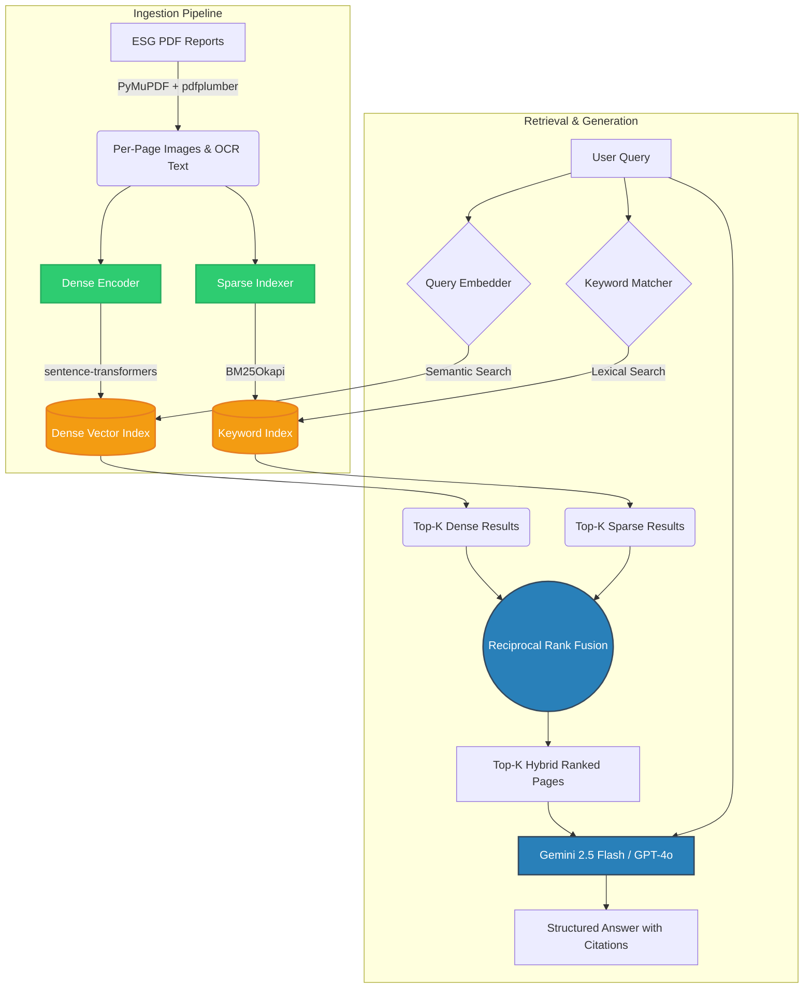

# Hybrid Dense-Sparse RAG for ESG Document Analysis

This repository contains a complete pipeline for processing, retrieving, and answering questions from ESG (Environmental, Social, and Governance) PDF reports. It uses a **Hybrid Dense-Sparse Retrieval** approach combined with **Reciprocal Rank Fusion (RRF)** to maximize retrieval accuracy across complex financial documents.

## Architecture Diagram

## What This Pipeline Does

1. **Ingestion**: Parses raw ESG PDFs into page-level images and extracts the text using Optical Character Recognition (OCR).
2. **Dense Retrieval**: Uses `sentence-transformers` (`all-MiniLM-L6-v2`) to create semantic vector embeddings of the page text. This runs efficiently on a CPU.
3. **Sparse Retrieval**: Uses a `BM25` index on the extracted text for exact-keyword matching (essential for specific metrics and company names).
4. **Hybrid Fusion**: Merges the results of both dense and sparse retrieval using Reciprocal Rank Fusion (RRF) to ensure the best pages bubble to the top.
5. **Generation**: Passes the retrieved context and user query to an LLM (like **Gemini 2.5 Flash**) to generate a highly accurate, structured answer with strict citations to the source pages.

## Getting Started

### Running the Notebook

The easiest way to run the entire pipeline is using the provided Jupyter Notebook: `Hybrid_Dense_Sparse_RAG.ipynb`.

1. **Open the Notebook**: You can open this notebook in Jupyter, Google Colab, or Kaggle. 
2. **Set your API Key**: Make sure you have your LLM API Key (e.g., Google Gemini API Key) securely set in your environment variables or secret manager (Do **NOT** hardcode it into the notebook).
3. **Upload Data**: Place your target PDF documents in the specified dataset directory (e.g., a `data/` folder).
4. **Run All**: Execute the cells from top to bottom. The notebook will automatically install dependencies, build the indexes, and run test queries.

### Dependencies

The project relies on standard, lightweight Python libraries:
- `sentence-transformers`
- `rank-bm25`
- `PyMuPDF`
- `google-generativeai`

No heavy GPU dependencies are strictly required since the dense retrieval model is highly optimized.

## License

This project is open-source and available for research and educational purposes.
